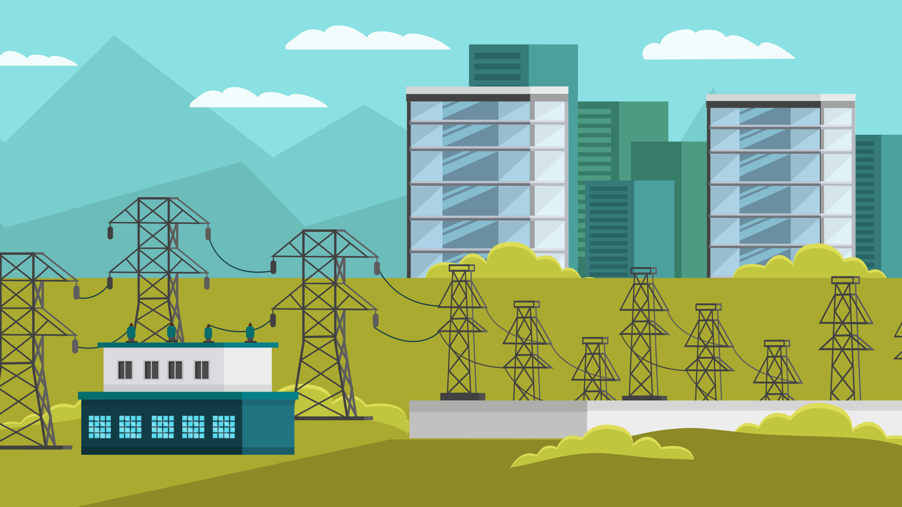
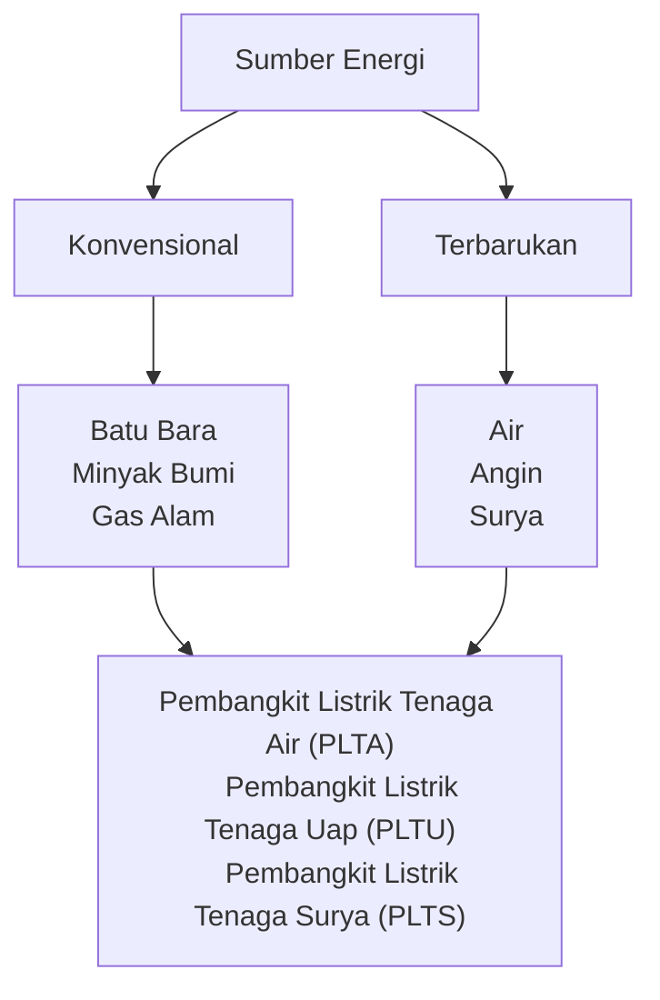

# Sumber Energi

---

Telah diketahui bahwa sumber energi dibagi menjadi dua, yaitu sumber energi konvensional dan terbarukan. Saat ini, ada kekhawatiran tentang menipisnya ketersediaan energi konvensional karena penggunaan yang tidak efisien. Oleh karena itu, perlu dilakukan upaya untuk meningkatkan pengembangan dan pemanfaatan sumber energi terbarukan. 

## Peta Konsep

## Kompetensi Inti

* Menghayati dan mengamalkan ajaran agama yang dianutnya
* Menunjukkan perilaku jujur, disiplin, tanggung jawab, peduli (gotong royong, kerja sama, toleran, damai), santun, responsif, dan pro-aktif sebagai bagian dari solusi atas berbagai permasalahan dalam berinteraksi secara efektif dengan lingkungan sosial dan alam serta menempatkan diri sebagai cerminan bangsa dalam pergaulan dunia 
* Memahami, menerapkan, menganalisis dan mengevaluasi pengetahuan faktual, konseptual, prosedural, dan metakognitif berdasarkan rasa ingin tahunya tentang ilmu pengetahuan, teknologi, seni, budaya, dan humaniora dengan wawasan kemanusiaan, kebangsaan, kenegaraan, dan peradaban terkait penyebab fenomena dan kejadian, serta menerapkan pengetahuan prosedural pada bidang kajian yang spesifik sesuai dengan bakat dan minatnya untuk memecahkan masalah
* Mengolah, menalar, menyaji, dan mencipta dalam ranah konkret dan ranah abstrak terkait dengan pengembangan dari yang dipelajarinya di sekolah secara mandiri serta bertindak secara efektif dan kreatif, dan mampu menggunakan metoda sesuai kaidah keilmuan

## Kompetensi Dasar

* Menganalisis keterbatasan sumber energi dan dampaknya bagi kehidupan
* Menyajikan ide/gagasan dampak keterbatasan sumber energi bagi kehidupan dan upaya penyelesaian masalah dengan energi alternatif