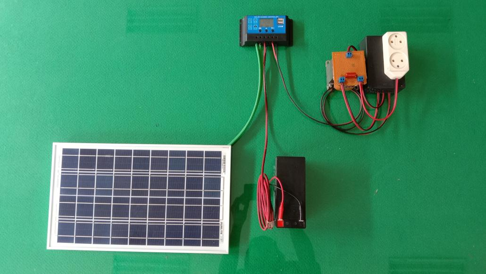

# Alat Peraga Sumber Energi Surya

---

## Tujuan Percobaan

1. test
2. test
3. test

## Dasar Teori

Dalam Pasal 1 ayat 2 Undang-undang Nomor 30 Tahun 2007 tentang Energi, tertulis bahwa sumber energi adalah sesuatu yang dapat menghasilkan energi, baik secara langsung maupun melalui proses konversi atau transformasi. Selain itu, sumber energi adalah sumber daya yang dapat diolah oleh manusia dan digunakan untuk memenuhi kebutuhan energi.

Ada banyak sumber energi yang digunakan dan dibagi menjadi dua, yaitu energi konvensional dan energi terbarukan. Energi konvensional adalah energi yang diambil dari sumber yang hanya tersedia dalam jumlah terbatas di bumi dan tidak dapat diregenerasi. Energi terbarukan adalah energi yang dihasilkan dari sumber alami dan dapat dihasilkan terus-menerus.

## Alat dan Bahan

## Cara Merangkai

## Cara Menggunakan

## Aplikasi *
