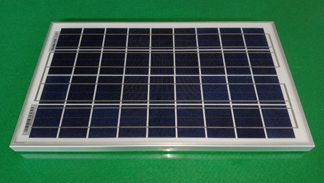
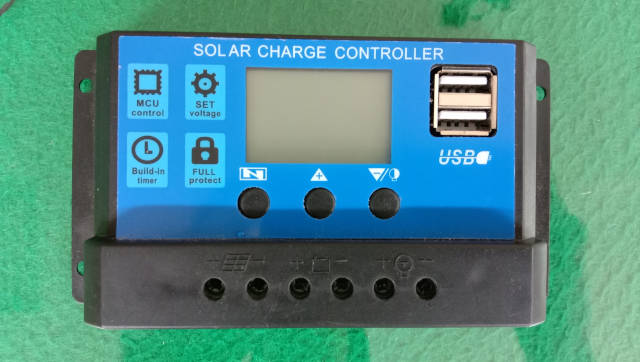
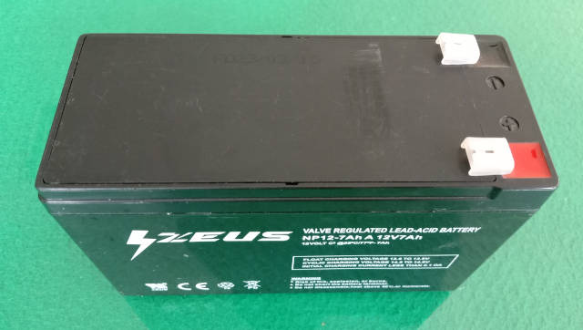
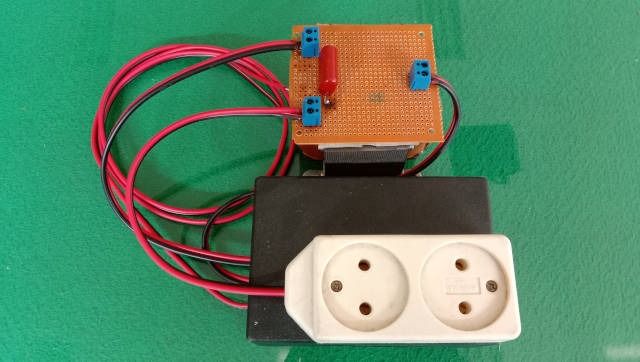

# Alat Peraga Pembangkit Listrik Tenaga Surya (PLTS)

---

## Tujuan Percobaan

1. Dapat merakit dan mengoperasikan sistem PLTS.
2. Dapat menganalisis kinerja sistem PLTS.
3. Dapat mengevaluasi kinerja sistem PLTS.

## Dasar Teori

Dalam Pasal 1 ayat 2 Undang-undang Nomor 30 Tahun 2007 tentang Energi, tertulis bahwa sumber energi adalah sesuatu yang dapat menghasilkan energi, baik secara langsung maupun melalui proses konversi atau transformasi. Selain itu, sumber energi adalah sumber daya yang dapat diolah oleh manusia dan digunakan untuk memenuhi kebutuhan energi.

Ada banyak sumber energi yang digunakan dan dibagi menjadi dua, yaitu energi konvensional dan energi terbarukan. Energi konvensional adalah energi yang diambil dari sumber yang hanya tersedia dalam jumlah terbatas di bumi dan tidak dapat diregenerasi. Sedangkan energi terbarukan adalah energi yang dihasilkan dari sumber alami dan dapat dihasilkan terus-menerus.

Salah satu dari sumber energi terbarukan adalah energi surya. Energi surya adalah energi yang berasal dari sinar dan panas matahari, menjadikannya sebagai sumber energi yang berlimpah, bebas polusi, dan tahan lama. Energi ini dapat dimanfaatkan dengan menggunakan berbagai teknologi seperti PLTS.

PLTS adalah sebuah sistem yang menggunakan efek fotovoltaik untuk mengubah energi matahari menjadi energi listrik. Fotovoltaik adalah fenomena fisika yang terjadi pada permukaan sel surya ketika menerima sinar matahari. Kemudian cahaya yang diterima diubah menjadi energi listrik.

## Alat dan Bahan

| No. | Nama Komponen | Gambar Komponen | Fungsi Komponen  |
|:---:|---|:---:|---|
| 1.  | Panel Surya |  | Mengubah sinar surya menjadi energi listrik |
| 2.  | _Solar Charger Controller_ (SCC) |  | Mengatur dan mengontrol pengisian baterai dengan mengatur tegangan dan arus yang dihasilkan oleh panel surya |
| 3.  | Baterai |  | Menyimpan energi yang diperoleh panel surya |
| 4.  | Inverter |  | Mengubah arus listrik searah (DC) yang disimpan oleh baterai menjadi arus listrik bolak-balik (AC) dan meningkatkan tegangan |

## Prosedur Percobaan

1. Tempatkan panel surya di lokasi yang mendapatkan sinar matahari yang optimal.
2. Hubungkan baterai pada masukan baterai SCC.
3. Hubungkan panel surya pada masukan panel surya SCC.
4. Hubungkan inverter pada keluaran beban SCC.
5. Lakukan pengujian untuk memastikan berfungsi dengan baik.

## Evaluasi

1. Jelaskan bagaimana sistem PLTS bekerja?
2. Apa saja kelebihan dan kekurangan dari sistem PLTS?
3. Bagaimana dampak penggunaan PLTS terhadap lingkungan?

## Kesimpulan

Kesimpulan apa yang didapat setelah melakukan percobaan dan mengevaluasi pada sistem PLTS?